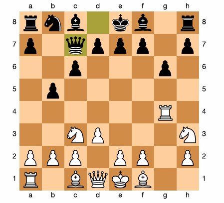

# Chess game 

# Implemented

- board state evaluation based on pieces weights (pretty base solution)
- minimax search algorithm for best move/optional depth
- alpha-beta search tree pruning 
- game class for games with different players
- game result stats

# Problems

- Bots don't know how to end a game, so it almost always ends in a draw. Possible solution: [endgame tablebase](https://en.wikipedia.org/wiki/Endgame_tablebase).
- Minimax for depth > 4 execution takes forever even with alpha-beta pruning and move sorting by pieces importance. Possible solution: tree caching, better heuristic, parallelization (oh that's hard), build tree only for some promising moves (for example in some range from the opponent).

# TODO:

- [x] player class & methods for human play
- [x] game loop for random player & human player
- [x] simple func for game generations and saving result stats
- [x] add minimax method for simple eval by pieces weigths
- [x] different weights for board eval -> stats bot vs bot
- [x] alpha-beta pruning
- [x] too long - sort possible moves by pieces: more weight at first -> better pruning
- [ ] caching (???)

